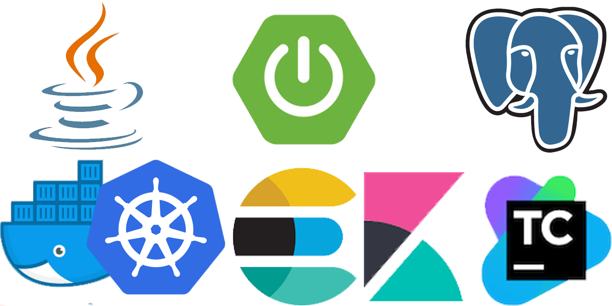

© 2019-2020 WeebIndustrial

* [WeebJournal-rest](#weebjournal)
* [Tech stack](#tech-stack)
* [Getting Started](#getting-started)
* [Contributing](#contributing)
* [Needs for help](#needs-for-help)

# WeebJournal-rest    

The community for anime artisan, a future sekai of Weebs!

This is only the RestAPI Microservice of WeebJournal not the entire website! 

## Tech stack

- Java 
- Spring Boot
- Postgresql
- Docker + Kubernetes
- Elasticsearch + Kibana
- TeamCity

## Getting Started

1. How to contribute to this repo

- Fork this repo to your own one
- Create a new branch which follows this format `wj-<YourName>-<pull_request_name_or_some_tag_you_want>`. For instance: `wj-Aragami1408-add_sharing_post_feature`
- When you've done your work, create a pull request to this repo

2. How to build and run this?

- Pull the [Docker](https://www.docker.com/) image via [Docker Hub](https://hub.docker.com/r/aragami1408/weebjournal):

- Run the image: `docker run -d -p 5000:1408 weebjournal` and start using by typing `localhost:1408` at your browser

## Contributing

You are **free** to do that. I'm very pleasure of your contributions! But this repo is just the backend infrastructure(responses are only JSON) so please do not ask anything related to front-end.

Obviously, you are prohibited to commit directly in `master` in any kind. Create your own and work for it. After working for a while, you can make pull request(s). We hope to receive lots of pull request from you guys.

## Needs for help

Follow these options if you encountered a problem:

**Issues**

If your problem quite big and need a serious discussion, github issue is the best choice. But please `make sure to search carefully`, maybe there are some issues that has same problem to your issue. Creating an issue can be there permanently for other members so feel free to open issue

**Discord server**

[discord server](https://discord.gg/qYp5f5e). This server comprises of:
- Development changelog at `#announcement channel`
- progress discussion at `DEV` category.